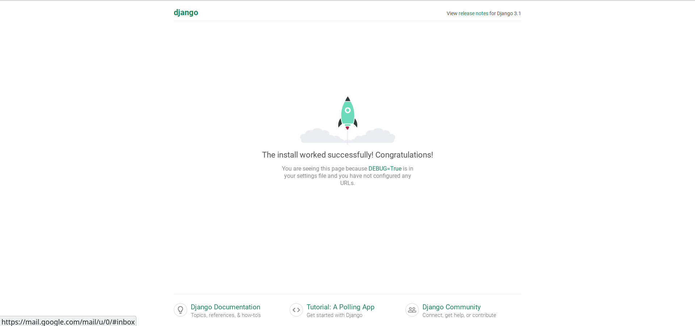
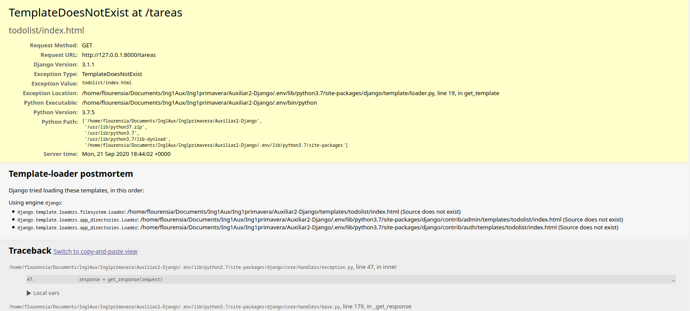

# Auxiliar2-Django
PONER una imagen de lo que haremos y una descripción de la app. 
## Configuración del ambiente de trabajo
El primer paso en esta auxiliar será crear un ambiente virtual donde estará toda la configuración de Python 
para este proyecto en específico. 
Dado que DjangoGirls explica muy bien cómo hacer esto, debes seguir los pasos de [este tutorial](https://tutorial.djangogirls.org/es/django_installation/) hasta donde activan el ambiente virtual. 
Al tener el ambiente virtual activado, vuelve aquí para el siguiente paso. 

## Descargar e instalar TODO Project 
En la auxiliar de hoy no vas a comenzar un proyecto de Django desde 0 
sino que usarás un proyecto que ya está configurado con lo básico para crear el **TODO Project**.  

1. 
    La primera tareas es hacer Fork y Clone de [este repositorio](https://github.com/Aux-Ing-1/Auxiliar2-Django). 
    > Si no recuerdas como hacerlo puedes revisar la [auxiliar de GIT](https://github.com/Aux-Ing-1/Auxiliar1-GIT). 
2. 
    Para entrar a la carpeta donde está el proyecto hay que hacer `cd Auxiliar2-Django` en la consola. 
3. 
    Para poder utilizar esta app hay que instalar los paquetes que el proyecto requiere. 
    Para esto instalaremos la lista de paquetes que viene en el archivo `requirements.txt` con el siguiente comando: 
    ```
   pip install -r requirements.txt
   ```
4. 
    El project de Django trae algunas tablas de la base de datos pre hechas, 
    por lo tanto tenemos que avisarle que actualice sus tablas con el siguiente comando: 
    ```
   python manage.py migrate
   ``` 
5.
    Habiendo configurado el proyecto en tu computador deberías poder acceder a la aplicación web con el siguiente comando:
    ```
   python manage.py runserver
   ```   
   Al entrar a `http://127.0.0.1:8000/` deberías ver lo siguiente: 
    

5. 
    La estructura de las carpetas debería quedar así:
    ``` 
    Auxiliar2-Django
    ├───manage.py
    ├───TODOproject
    │   │ settings.py
    │   │ urls.py
    │   │ wsgi.py
    │   │ __init__.py
    ├───db.sqlite3
    ├───README.md
    └───requirements.txt 

    ```    
          
## Crear una nueva app: todoapp 
Como se explicó en la clase Django está compuesto por apps que forman las diferentes partes de la aplicación web. 
Para esta auxiliar solo haremos una app con toda la funcionalidad. Esta se llamará **todoapp**. 

1. **Crear la app**

    Lo primero será crear la app. Para eso haremos el siguiente comando en la consola: 
    ```
   python manage.py startapp todoapp
   ```
   > Dato: se recomienda que en el nombre de la app solo hayan minúsculas, 
   >y se puede utilizar _ para hacer el nombre mas legible.  
   >Para mas guías de estilo para python puedes revisar [PEP 8](https://www.python.org/dev/peps/pep-0008/)
    *  
        La estructura de las carpetas debería quedar así:
        ```
        Auxiliar2-Django
        ├───manage.py
        ├───TODOproject
        │   ├───settings.py
        │   ├───urls.py
        │   ├───wsgi.py
        │   ├───__init__.py
        ├───todoapp
        │   ├───admin.py
        │   ├───apps.py
        │   ├───models.py
        │   ├───tests.py
        │   ├───views.py
        │   ├───__init__.py
        ├───db.sqlite3
        ├───README.md
        └───requirements.txt 
        ```                                                                                                                                                                
2. **Agregar la app a installed_apps**

    Para que el project sepa que existe esta nueva app hay que agregarla a `installed_apps` en el archivo `settings.py` de `TODOproject`. 
    
    Primero tienes que importar la app al inicio del archivo `settings.py` así : 
        ```import todoapp```
    
    Y luego agregarla a la variable `installed_apps` para que quede así:
    ```
   INSTALLED_APPS = [
    'django.contrib.admin',
    'django.contrib.auth',
    'django.contrib.contenttypes',
    'django.contrib.sessions',
    'django.contrib.messages',
    'django.contrib.staticfiles',
    'todoapp',
    ]
   ```        
3. **Crear modelos Tarea y Categoría**
    Para crear aplicación de lista de tareas debemos crear un *modelo* 
    que permitirá definir la información que guardaremos de cada elemento.
    
    Los modelos se guardan en el archivo *todoapp/models.py*.
    En este caso crearemos un modelo llamado Tarea que tendrá un *título*, *contenido*, *fecha de creación* y *categoría*.
    La categoría será una llave foránea al modelo Categoría.  
    
    * El primer modelo que crearás es **Categoría**, que solo tendrá un atributo nombre, para esto copia el siguiente código en *todoapp/models.py*: 
        ```python
    class Categoria(models.Model): 
        nombre = models.CharField(max_length=100)
    
        def __str__(self):
            return self.name #name to be shown when called

       ```
       > La clase Category hereda de models.Model para tener todas las características de un model de Django. 
    
       > El atributo nombre será un CharField con un largo máximo de 100 caracteres. [Aquí](https://docs.djangoproject.com/en/3.1/ref/models/fields/#field-types)  hay mas información sobre Fields.  
    
       > El método _ _ str_ _ permite definir como se mostrará una categoría al imprmirla. 
   * Ahora vas a crear el modelo Tarea con todos sus atributos, para esto copia el siguiente código abajo del modelo Categoría:
        ```python
    from django.utils import timezone

    class Tarea(models.Model): #Todolist able name that inherits models.Model
       titulo = models.CharField(max_length=250) # un varchar
       contenido = models.TextField(blank=True) # un text 
       fecha_creación = models.DateField(default=timezone.now().strftime("%Y-%m-%d")) # un date
       categoría = models.ForeignKey(Categoria, default="general", on_delete=models.SET_DEFAULT) # la llave foránea
    
       def __str__(self):
           return self.title #name to be shown when called
        ```   
     > En este modelo utilizamos atributos de diferentes tipos como texto y fechas. 
                                                                                                                                                                                                                                                                                                                                                                                                                                                                                                                                                                                                                                                                                                                                                              
     > La variable blank=True en el atributo `contenido` indica que este atributo puede estar en blanco. 
    
     > La variable default = ... en el atributo `fecha_creacion` indica que si no se entrega una fecha de creación, por defecho se pondrá la fecha actual.   
    
     > Para crear una llave foránea utilizamos `models.ForeignKey` y hay que entregar el modelo que será la llave foránea y una opción de `on_delete`. [Información sobre on_delete](https://docs.djangoproject.com/en/3.1/ref/models/fields/#django.db.models.ForeignKey.on_delete)  
    
   * El último paso es agregar estos modelos a la base de datos del proyecto. Para esto hay que seguir dos pasos: crear las migraciones y migrar.
    
        >Según la documentación oficial "Las migraciones son la forma que tiene Django de propagar cambios que le hacemos a los modelos hacia la base de datos". 
        
        Para hacer esto haremos los siguientes comandos en la terminal: 
        ```
            python manage.py makemigrations
            python manage.py migrate
       ```
       Después de hacer estos dos comandos puedes ver que la carpeta *todoapp/migrations* tiene un nuevo archivo, 
       con todos los cambios que hiciste a los modelos. 
     
    No agregaremos elementos a la base de datos aún, sino que seguiremos creando la aplicación para ver la lista de tareas. 
  4. **Crear urls**
     
     Como vimos en la primera parte de la clase, las urls determinan "por donde se puede entrar" a la aplicación web, es por esto que será lo siguiente que vamos a crear. 
    
        * Lo primero que harás es hacer que las urls de la todoapp queden disponibles en todo el project. 
            Para esto, debes ir al archivo *TODOproject/urls.py* y agregar la siguiente linea de código en la lista de `url_patterns`:
            ```python
            path('', include('todoapp.urls'))
            ```  
          También debes incluir el método include en el archivo, para esto agrega la siguiente línea al inicio de *TODOproject/urls.py*: 
            ```python
              from django.urls import include
            ```    
        * Ahora hay que crear las urls de la todoapp. Lo que harás es crear una url para que cuando alguien ingrese a 
        `127.0.0.1/tareas` pueda ver sus tareas. 
            
            Para esto hay que crear un archivo llamado `urls.py` en la carpeta `todoapp`. En este archivo escribirás el siguiente código: 
            ```python
          from django.urls import path
          from . import views
        
          urlpatterns = [
              path('tareas', views.tareas, name='mis_tareas'),
          ]         

            ```  
            El método `path` hará un mapeo entre la el patrón de la url,
         *en este caso 'tareas'*, con el método `tareas` de views.py, para saber qué hacer cuando alguien ingrese a esta url. 
                
5. **Crear views** 

    En el paso anterior creaste una url 'tareas' que está "mapeada" con el método tareas de views.py. 
    Es por esto que ahora crearás este método para que cargue una interfaz que muestra todas las tareas guardadas. 
    
    En el archivo *todoapp/views.py* tendrás que pegar este código que explicaré luego: 
    ```python
    from django.shortcuts import render, redirect

    # Create your views here.
    from todoapp.models import Tarea, Categoria
    
    
    def tareas(request): #the index view
       tareas = Tarea.objects.all()  # quering all todos with the object manager
       categorias = Categoria.objects.all()  # getting all categories with object manager
    
       if request.method == "GET":
           return render(request, "todoapp/index.html", {"tareas": tareas, "categorias": categorias})

    ```
   Los métodos de las views siempre deben recibir una request, porque ahí se encuentra la información de la request HTTP.
   
   En este caso, la view tendrá una variable tareas que tendrá todas las tareas de la base de datos. 
   Y otra variable categorias que tendrá todas las categorías de la base de datos. 
   >En la próxima auxiliar estudiaremos un poco mas en detalle como acceder a elementos de la base de datos. 
   
   Como estamos cargando la página, la request que la aplicación recibe es de tipo GET, 
   y queremos que al recibir una request de este tipo se haga render de la página, es decir, mostrar la página de tareas.  
   
   El último parámetro del método render es un diccionario con toda la información que la view le entregará al template que vamos a cargar (que en este caso aun no existe). 

6. **Recapitulemos** 
    
   Hasta ahora hemos creado *los modelos* Tarea y Categoria,
    *una url* llamada *tareas*, y 
    *una view* que permite hacer render de un template (que aun no creamos) 
    y le entrega las tareas y categorías de la base de datos al template.
    
    Para comprobar que no tenemos errores en este paso tendrás que correr la aplicación y entrar a la url *tareas*. 
    Para esto en la consola debes hacer `python manage.py runserver` y entrar al link `127.0.0.1/tareas`. 
    
    Como aún no creamos un template llamado *index.html* deberías ver lo siguiente: 
    
    
    
7. **Creación del template**
    
    Ahora vamos a crear el template para mostrar todas las tareas.
    * Lo primero que hay que hacer es crear una carpeta llamada templates dentro de todoapp. 
    
        Después, hay que crear una carpeta llamada todoapp, dentro de la carpeta templates que recién creamos. 
        
        Esto lo hacemos así para distinguir entre las diferentes carpetas templates de las diferentes aplicaciones que tenga la aplicación web. 
        
        Finalmente hay que crear un archivo vacío llamado `index.html` en la carpeta todospp/templates/todoapp/.
        
        Al final de este paso las carpetas deberían quedar así:
         ```
        Auxiliar2-Django
        ├───manage.py
        ├───TODOproject
        │   settings.py
        │   urls.py
        │   wsgi.py
        │   __init__.py
        ├───todoapp
        │   ├───migrations
        │   │   001_initial.py
        │   ├───templates
        │   │   ├───todoapp
        │   │      index.html
        │   admin.py
        │   apps.py
        │   models.py
        │   tests.py
        │   views.py
        │   urls.py
        │   __init__.py
        ├───db.sqlite3
        ├───README.md
        └───requirements.txt 
        ```   
        Ahora si corres la aplicación y entras a `127.0.0.1/tareas` deberías ver una página en blanco.  
  
  
  
  
sdgdg